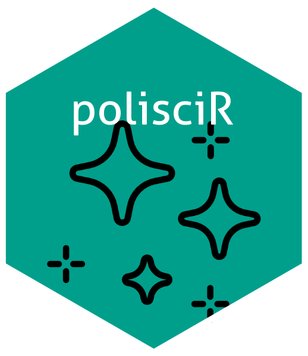
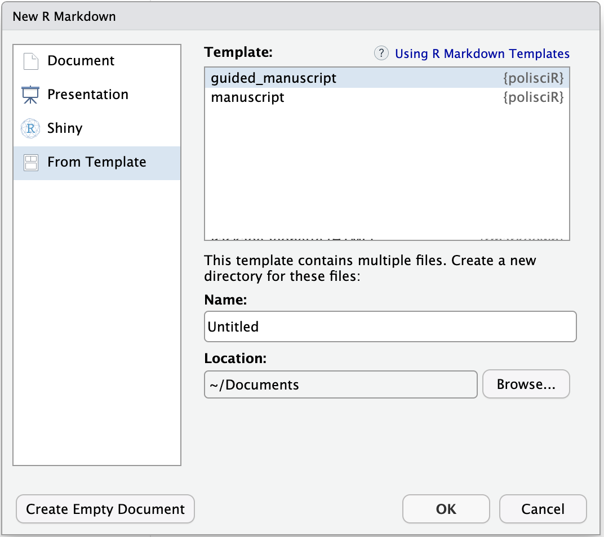

<!-- Improved compatibility of back to top link: See: https://github.com/othneildrew/Best-README-Template/pull/73 -->

<a id="readme-top"></a> <!--
*** Thanks to Othneil Drew (https://github.com/othneildrew) for his Best-README-Template. 
-->

<!-- PROJECT SHIELDS -->

[](https://github.com/studycourts/polisciR/graphs/contributors) [](https://github.com/studycourts/polisciR/network/members) [](https://github.com/studycourts/polisciR/stargazers) [](https://github.com/studycourts/polisciR/issues) [](https://github.com/studycourts/polisciR/blob/master/LICENSE.txt) [](https://linkedin.com/in/rebeccadgill)

<!-- PROJECT LOGO -->

{width="45%"}

### <strong>polisciR</strong> is a package of templates for stuff that political scientists make.

<!-- TABLE OF CONTENTS -->

<details>

<summary>Table of Contents</summary>

<ol>

<li><a href="#about-the-project">About The Project</a>

<li><a href="#getting-started">Getting Started</a>

<li><a href="#prerequisites">Prerequisites</a></li>

<li><a href="#installation">Installation</a></li>

<li><a href="#usage">Usage</a></li>

<li><a href="#roadmap">Roadmap</a></li>

<li><a href="#contributing">Contributing</a></li>

<li><a href="#license">License</a></li>

<li><a href="#contact">Contact</a></li>

<li><a href="#acknowledgments">Acknowledgments</a></li>

</ol>

</details>

<!-- ABOUT THE PROJECT -->

## About the Project

This package includes templates to help political scientists create the things that political scientists need to create. Currently, the package includes the following templates:

-   `manuscript`: for those who already know what should go in a political science research paper, this template will create a pdf document in the style of a mid-2020s political scientist.
-   `guided_manuscript`: for those who need a bit of help turning their ideas into a political science research paper, this one contains default content to walk you through the process.

The manuscript templates in this package, are based on the **bookdown** format. They rely upon LaTeX templates (included in the folder that's created with your new manuscript) that give your manuscript that mid-2020s political science look. These LaTeX templates are highly annotated, so you can peek inside to adjust things like line spacing, indents, and more. But you don't have to. When you're writing, you can still use [markdown](https://rmarkdown.rstudio.com/authoring_basics.html) syntax R code to customize things a bit.

<p align="right">

(<a href="#readme-top">back to top</a>)

</p>

<!-- GETTING STARTED -->

## Getting Started

This is an example of how you may give instructions on setting up your project locally. To get a local copy up and running follow these simple example steps.

### Prerequisites

To get up and running, you'll need to make sure you've got a few things handled: Then, ensure that you've installed the following:

-   [R and RStudio](https://rstudio-education.github.io/hopr/starting.html) (comes installed with [pandoc](http://pandoc.org/), which is good because you need it)

-   [tinytex](https://yihui.name/tinytex/) (a tiny LaTeX) and [rmarkdown](https://rmarkdown.rstudio.com/docs/) (markdown for R)

    ``` r
    install.packages(c('tinytex', 'rmarkdown'))
    tinytex::install_tinytex()

    # check that it worked after restart
    tinytex::is_tinytex()
    ```

### Installation

Once you've ensured that you've got all the prerequisites organized, you can install the **polisciR** package and the [bookdown](https://bookdown.org/) package on which it relies)

``` r
if (!require("devtools")) {
  install.packages("devtools", repos = "http://cran.rstudio.org")
}
devtools::install_github("rstudio/bookdown")
devtools::install_github("studycourts/polisciR")
```

(<a href="#readme-top">back to top</a>)

</p>

<!-- USAGE EXAMPLES -->

## Using **polisciR** Templates

To use **polisciR** templates from inside RStudio, start by creating a new file through the menus: `File -> New File -> R Markdown`. You'll see a dialog box where you can select from one of the available templates:

<figure>

{width="50%"}

</figure>

You can use the templates outside of RStudio, but you’ll also need [Pandoc](https://pandoc.org) ([find some help here](https://bookdown.org/yihui/rmarkdown-cookbook/install-pandoc.html)). Then, you can use the `rmarkdown::draft()` function to create your political science stuff:

``` r
rmarkdown::draft(
    "MyManuscript.Rmd", template = "manuscript", package = "polisciR"
)
```

This will create a folder containing a your new Rmd file and all of the other things you'll need to render it.

<p align="right">

(<a href="#readme-top">back to top</a>)

</p>

<!-- CONTRIBUTING -->

## Contributing

The original templates were created by a regular, run-of-the-mill political scientist. She's done her best, but can always use help. If you've developed a helpful template (or just have suggestions on how to make the existing **polisciR** templates better), here are some ways you can pitch in:

### Suggest an idea

You may not feel confident enough or may not have time to contribute a whole template. By opening a new issue, you can share your ideas and see if someone else can help make it happen. Because the author of this package is just one person, though, she might not be able to get to it ~~in a timely manner~~ ever. But hey, it's worth a shot!

### Contribute your template

Contributions are what make the open source community such an amazing place to learn, inspire, and create. Any contributions you make are **greatly appreciated**. If you've got a template that you find useful for political science-y things, add it to the pile! You'll start by opening a new [pull request (PR)](https://docs.github.com/en/pull-requests/collaborating-with-pull-requests/proposing-changes-to-your-work-with-pull-requests/about-pull-requests#draft-pull-requests):

1.  Fork the Project
2.  Create your Feature Branch (`git checkout -b feature/AmazingFeature`)
3.  Commit your Changes (`git commit -m 'Add some AmazingFeature'`)
4.  Push to the Branch (`git push origin feature/AmazingFeature`)
5.  Open a Pull Request

If your template isn't quite ready for prime time, you can use a [draft PR](https://docs.github.com/en/github/collaborating-with-issues-and-pull-requests/about-pull-requests#draft-pull-requests) to let everyone know what you're up to (and perhaps find some folks who are willing to help). Once it's ready to go, just submit it for review and we'll get it merged in.

<p align="right">

(<a href="#readme-top">back to top</a>)

</p>

### Top contributors:

<a href="https://github.com/studycourts/polisciR/graphs/contributors">  </a>

<!-- ROADMAP -->

## Roadmap

-   [ ]  Add a conference presentation template
-   [ ]  Add a CV template that embeds .bib files

See the [open issues](https://github.com/studycourts/polisciR/issues) for a full list of proposed features (and known issues).

<p align="right">

(<a href="#readme-top">back to top</a>)

</p>

<!-- LICENSE -->

## License

Distributed under the MIT License. See `LICENSE.txt` for more information.

<p align="right">

(<a href="#readme-top">back to top</a>)

</p>

<!-- CONTACT -->

## Contact

Rebecca Gill - Bluesky: [\@rebeccagill.bsky.social](https://bsky.app/profile/rebeccagill.bsky.social) - email: [rebecca.gill\@unlv.edu](mailto:rebecca.gill@unlv.edu){.email}

Project Link: <https://github.com/studycourts/polisciR>

<p align="right">

(<a href="#readme-top">back to top</a>)

</p>

<!-- ACKNOWLEDGMENTS -->

## Acknowledgments

-   [Steven V. Miller](https://svmiller.com/stevetemplates/). I got the idea for this and much of the original code from his stevetemplates package.
-   [Lab-R-Torian](https://labrtorian.com/2019/08/26/rmarkdown-template-that-manages-academic-affiliations/). The address block is adapted from this idea.
-   [Thomas J. Leeper](https://github.com/leeper/apsa-leeper.bst). This is the source of the BibTeX style file used in these templates: apsa-leeper.bst.
-   [Othneil Drew](https://github.com/othneildrew/Best-README-Template). The README file you're looking at right now is thanks to this great template.
-   [hexSticker](https://github.com/GuangchuangYu/hexSticker). The adorable logo was made here.
-   [Freepic.](https://www.flaticon.com/free-icons/spark" title="spark icons") The sparkles in the **polisciR** package icon are from here.
-   A lot more folks whose ideas made their way into the code years ago before I ever thought about making a package out of my goofy little templates.

<p align="right">

(<a href="#readme-top">back to top</a>)

</p>

<!-- MARKDOWN LINKS & IMAGES -->

<!-- https://www.markdownguide.org/basic-syntax/#reference-style-links -->
